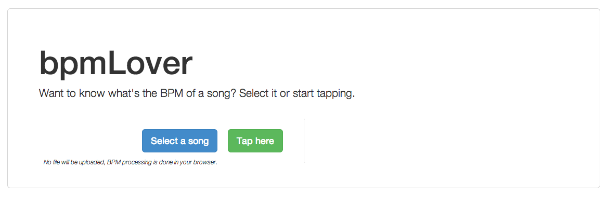
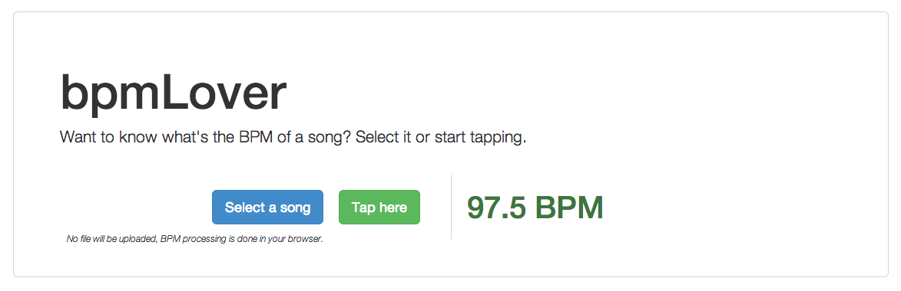

bpmLover
========

bpmLover is an online BPM Analyzer that allows you to analyze tempo of a song by selecting a file or by tapping with your mouse.
File processing is entirely done in Javascript, so there's no data sent to a remote server.

Website: <http://bpmlover.com>

Screenshots
===========

About the source code
=====================

### Library used ###

 - For sound processing:
   - [DSP.js](https://github.com/corbanbrook/dsp.js/)
   - [BeatDetektor.js](https://github.com/cjcliffe/beatdetektor/tree/master/js)
   
 - For website stuff
   - [Boostrap](http://getbootstrap.com/)
   - [jQuery](http://jquery.com/)
   - [underscore.js](http://underscorejs.org/)
   
### bpmLover's code ###

 - `App` takes care of the UI
 - `AudioFile` is a simple wrapper around `File` that provides utility functions such as `getAudioBuffer` or `getAudioData`.
 - `BPMWorker` takes audio data and computes the BPM using `DSP.js` and `BeatDetektor.js`.

### How it works ###

 - The main app (UI) is in `App.js`
 - When a file is selected, a new `AudioFile` is created. 
 - `App` creates a web worker: `BPMWorker.js` and sends it the audio data. 
 - `BPMWorker` cuts the audio data into 512-sample frames, and for each of them, applies FFT and sends it to an instance of `BeatDetektor`.
 - When this is complete, the web worker sends the bpm back to `App`, which then updates the UI.
 
### License ###

This code is under [GPL-License](https://www.gnu.org/licenses/gpl.html).